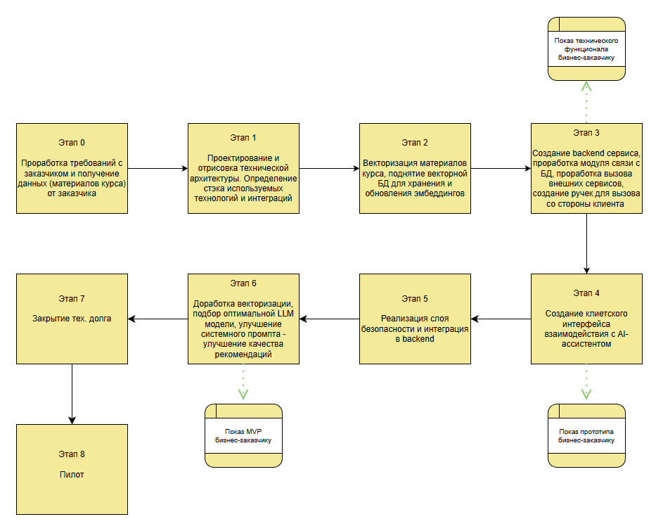
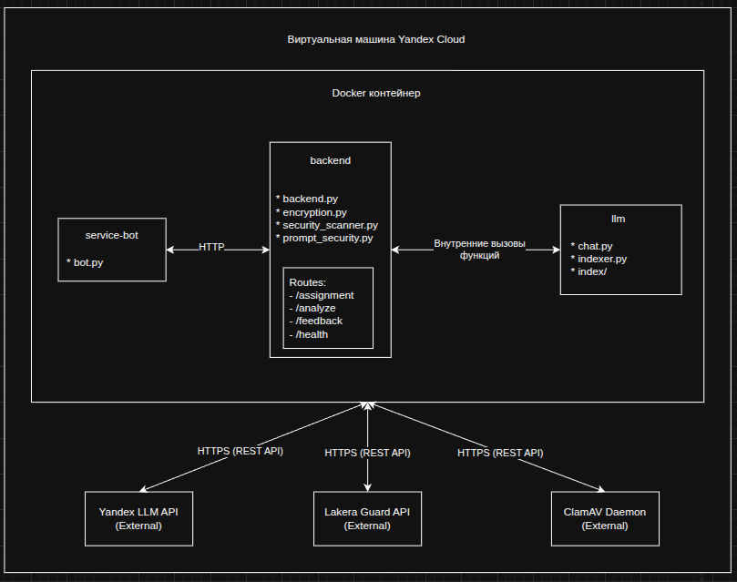

# ML System Design Doc - [RU]

## Дизайн ML системы - Jane AI Assistant MVP v1

### 1. Цели и предпосылки

#### 1.1. Зачем идем в разработку продукта?

- **Бизнес-цель**: повысить глубину и академическую глубину студенческих работ по урбанистике, снизив при этом
  нагрузку на преподавателей по рутинной проверке и выдаче однотипных комментариев путем внедрения AI-ассистента,
  выдающего рекомендации по студенческим работам.
- **Почему станет лучше, чем сейчас, от использования ML**: AI-ассистент будет предоставлять быструю и содержательную
  обратную связь, основанную на материалах курса, побуждающую студентов работать с первоисточниками, что приведет к качественному улучшению их работ.
  Преподаватель освобождается от рутинных задач и фокусируется на сложных кейсах, либо на других задачах.
- **Что будем считать успехом итерации с точки зрения бизнеса**: увеличение количества релевантных ссылок на
  академические источники в финальных работах студентов после получения фидбека от AI-ассистента, а также положительные
  отзывы от пилотной группы студентов и преподавателя о полезности и релевантности рекомендаций.

#### 1.2. Бизнес-требования и ограничения

- **Бизнес-требования**: реализовать и внедрить AI-ассистента, который анализирует
  тексты студенческих работ и дает обратную связь в стиле Джейн Джекобс, рекомендуя конкретные концепции и источники из
  учебной программы курса.
- **Бизнес-ограничения**:
    1. время разработки ~45-60 дней;
    2. интеграция в привычную, удобную и доступную для студентов среду;
    3. обеспечение анонимности и конфиденциальности студенческих работ;
    4. устойчивость к попыткам злоупотребления (prompt-инъекции, спам);
    5. возможность отправки работ в разных форматах.
- **Что мы ожидаем от конкретной итерации**: рабочий прототип, способный анализировать текстовые файлы и давать
  содержательные ответы, основанные на предоставленной базе знаний - программе курса.
- **Описание бизнес-процесса пилота**: преподаватель на семинарах дает домашнее задание в виде эссе и рекомендует
  воспользоваться AI-ассистентом для получения более высоких баллов за работу -> студент загружает черновик
  работы в AI-ассистента -> получает анализ и рекомендации -> дорабатывает работу на основе фидбека -> сдает финальную
  версию преподавателю -> преподаватель проверяет улучшенную версию работы.
- **Критерии успешного пилота**: ассистент активно используется студентами, его рекомендации воспринимаются как полезные
  и приводят к конкретным улучшениям в работах. Преподаватель подтверждает снижение нагрузки на проверку
  и улучшение качества работ.

#### 1.3. Что входит в скоуп проекта/итерации, что не входит

- **Входит в скоуп**:
    1. разработка Telegram-бота как поверхности взаимодействия с пользователем;
    2. создание backend для обработки запросов и вызова LLM;
    3. реализация RAG для индексации предоставленных материалов курса;
    4. интеграция с Yandex LLM API для генерации ответов;
    5. внедрение базовой системы безопасности (защита от prompt-инъекций и вредоносных файлов, анонимизация данных).
- **Что не будет закрыто**:
    1. разработка веб-интерфейса;
    2. интеграция с академическими системами университета.
- **Описание результата с точки зрения качества кода и воспроизводимости решения**: код модульный, задокументирован,
  упакован в Docker-контейнеры для обеспечения воспроизводимости, по возможности обеспечение 99% доступности системы.
- **Описание планируемого технического долга**: живем без долгов :)

#### 1.4. Предпосылки решения <small> (Описание всех общих предпосылок решения, используемых в системе – с обоснованием от запроса бизнеса: какие блоки данных используем, горизонт прогноза, гранулярность модели, и др.) </small>

- **Блоки данных**: используется предоставленная преподавателем литература курса, составляющая базу знаний
  AI-ассистента.
- **Горизонт прогноза**: в NLP/LLM задачах зависит от модели и от ее количества предсказываемых следующих токенов.
- **Гранулярность модели**: модель работает на уровне отдельно взятой студенческой работы, например эссе.

### 2. Методология

#### 2.1. Постановка задачи

- **Что делаем с технической точки зрения**: задача анализа текста (Text Analysis) и интеллектуального поиска
  информации (Information Retrieval) с последующей генерацией текстового ответа (Text Generation). По сути, это система
  вопросно-ответная система (QA) основанная на закрытом наборе документов.

#### 2.2. Блок-схема решения

### 3. Полезная информация по проекту

#### 3.1 Черновая архитектура

